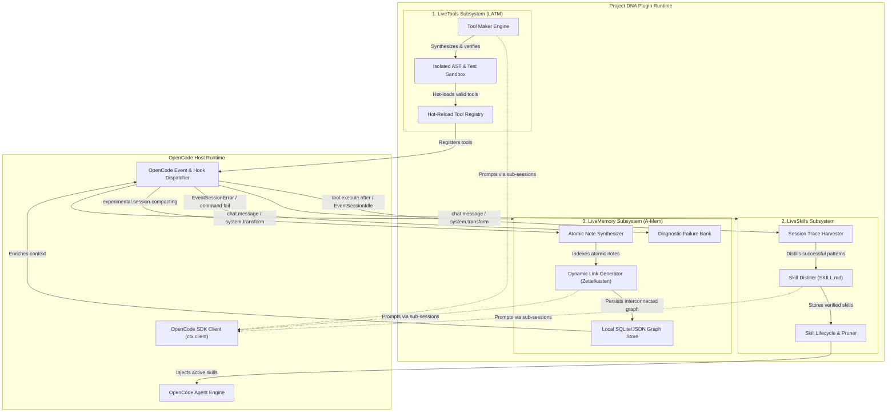

# Project DNA (Dynamic Neuro-Adaptive Architecture)
### Self-Synthesizing Procedural & Epistemic Runtime Plugin for OpenCode

[](https://www.typescriptlang.org/)
[](https://opencode.ai)
[](#)

---

## 1. Executive Summary

**Project DNA** is an autonomous runtime extension for [OpenCode](https://opencode.ai) that transitions the coding agent from a static consumer of pre-compiled tools into an **autonomous architect of its own procedural capabilities and experiential memory**.

Traditional coding agents operate under static constraints: tools must be pre-registered by developers, procedural workflows are hardcoded in static system prompts, and memory is reduced to unindexed log dumping into basic vector stores. 

Project DNA operationalizes three recent paradigms into a cohesive OpenCode TypeScript plugin:
1. **LiveTools (The LATM Paradigm)**: The agent dynamically synthesizes reusable TypeScript/JavaScript tools, verifies them in an isolated test harness against edge cases, and hot-reloads them directly into OpenCode's active tool registry.
2. **LiveSkills (Dynamic Agent Skills Lifecycle)**: Rather than relying on rigid instructions, the agent extracts multi-step workflows from successful interactive traces, distills them into modular `SKILL.md` packages, verifies them adversarially, monitors degradation, and prunes stale skills.
3. **LiveMemory (A-Mem / Zettelkasten Knowledge Graph)**: The agent maintains autonomous control over an associative note network. When events occur (successes, errors, user corrections), the agent synthesizes atomic Zettelkasten cards and triggers dynamic link generation to establish conceptual and causal connections without rigid schemas.

Project DNA requires **zero additional LLM credentials**. It communicates with OpenCode's internal SDK (`@opencode-ai/sdk`) to reuse the host environment's configured providers and models for background synthesis.

---

## 2. System Architecture Overview



---

## 3. The Three Core Pillars

| Pillar | Theoretical Foundation | Operational Mechanism in OpenCode |
| :--- | :--- | :--- |
| **LiveTools** | Large Language Models as Tool Makers (LATM) | When a recurring algorithmic or data-transformation task is recognized, the agent synthesizes a native TypeScript tool adhering to `@opencode-ai/plugin/tool`, tests it in an isolated subprocess with synthetic assertions, and hot-injects it into the live session. |
| **LiveSkills** | Dynamic Agent Skills & Self-Evolving Libraries (Voyager / Mid-2026 Skill Stores) | Multi-step interactive execution traces are harvested from `EventSessionIdle`. The plugin distills these into standardized `SKILL.md` packages (metadata + guidelines + reference scripts), continuously scoring them for effectiveness and retiring underperforming ones. |
| **LiveMemory** | Agentic Memory (A-Mem) & Zettelkasten Knowledge Systems | Successes, failures, and conventions are converted into schema-free atomic memory cards. A background link generator builds semantic and causal connections between memories, providing associative recall and enriching OpenCode's `experimental.session.compacting` hook. |

---

## 4. Zero-Friction LLM Reuse

Project DNA does not maintain separate API keys or external inference clients. Instead, it reuses the authenticated OpenCode environment:

```typescript
// Background synthesis via OpenCode SDK client
const backgroundSession = await ctx.client.session.create({
  body: {
    title: "DNA: Background Tool Synthesis",
  },
});

const response = await ctx.client.session.prompt({
  path: { id: backgroundSession.data.id },
  body: {
    system: TOOL_MAKER_SYSTEM_PROMPT,
    parts: [{ type: "text", text: taskSpecification }],
  },
});
```

* High-capability reasoning tasks (Tool Maker, Skill Distillation) leverage the user's primary model.
* Fast classification tasks (link generation, tag assignment) leverage `experimental.provider.small_model` if configured.
* All background sessions run headless without polluting the user's conversation transcript.

---

## 5. Documentation Directory

Detailed technical specifications and schemas are structured as follows:

```
Project DNA/
├── README.md                           # This document
├── docs/
│   ├── ARCHITECTURE.md                 # System architecture & cross-pillar flows
│   ├── LIVETOOLS_SPEC.md               # Tool Maker, sandbox verification & registry
│   ├── LIVESKILLS_SPEC.md              # Skill distillation, SKILL.md packaging & pruning
│   ├── LIVEMEMORY_SPEC.md              # A-Mem Zettelkasten, link generator & diagnostic bank
│   └── OPENCODE_INTEGRATION_SPEC.md    # OpenCode hooks, events & client SDK protocol
└── specs/
    ├── schemas/
    │   ├── tool-package.schema.json    # JSON Schema for synthesized tools
    │   ├── skill-package.schema.json   # JSON Schema for dynamic skills
    │   └── memory-card.schema.json     # JSON Schema for Zettelkasten memory cards
    └── contracts/
        ├── opencode-plugin.ts          # OpenCode plugin entry point contract
        ├── live-tools.ts               # LiveTools interfaces
        ├── live-skills.ts              # LiveSkills interfaces
        └── live-memory.ts              # LiveMemory interfaces
```
