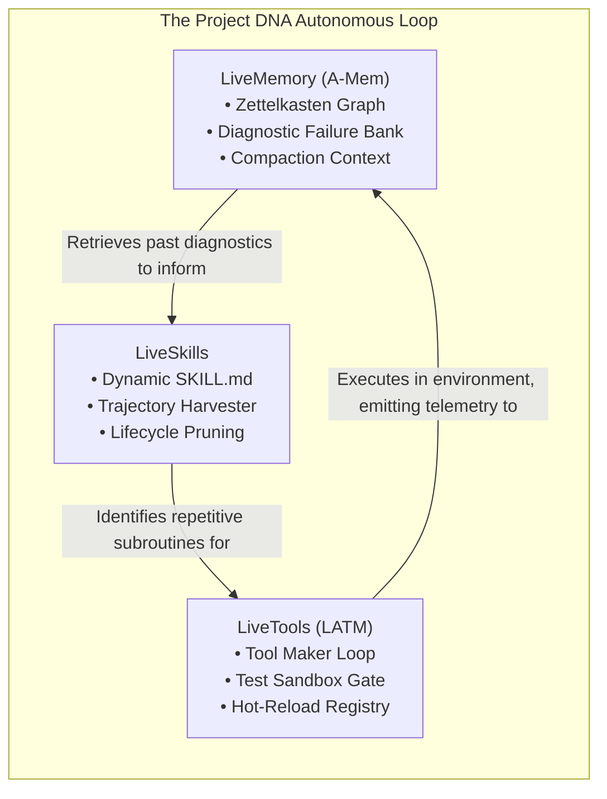
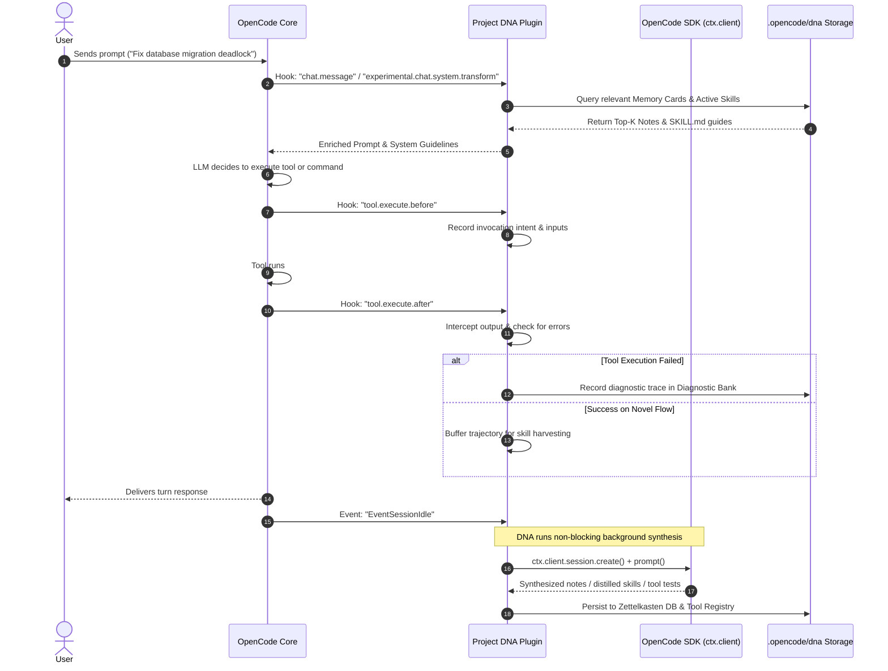

# Project DNA: High-Level Architecture

## 1. Architectural Philosophy

Project DNA re-architects the OpenCode coding agent into an autonomous, self-evolving system. Rather than treating capabilities as static code shipped with the plugin, Project DNA establishes three self-contained recursive engines:

1. **Procedural Execution (LiveTools)**: Dynamic synthesis and hot-reloading of verified atomic functions (`@opencode-ai/plugin/tool`).
2. **Procedural Strategy (LiveSkills)**: Dynamic synthesis and lifecycle management of multi-step, context-aware operational workflows (`SKILL.md`).
3. **Epistemic & Diagnostic State (LiveMemory)**: Schema-free, self-organizing Zettelkasten note graph (A-Mem) coupled with a failure/diagnostic telemetry bank.



---

## 2. Directory Layout & Persistence Model

Project DNA persists its state within the user's workspace under `.opencode/dna/`. This ensures all learned capabilities are repository-specific, version-controllable via git (or gitignored if private), and portable.

```
.opencode/
└── dna/
    ├── config.json                     # DNA plugin runtime configuration
    ├── tools/                          # LiveTools directory
    │   ├── registry.json               # Active & deprecated tools index
    │   ├── src/                        # Synthesized TypeScript tool implementations
    │   │   ├── git_stash_analyzer.ts
    │   │   └── protobuf_diff.ts
    │   └── tests/                      # Synthetic unit test suites
    │       ├── git_stash_analyzer.test.ts
    │       └── protobuf_diff.test.ts
    ├── skills/                         # LiveSkills directory
    │   ├── index.json                  # Semantic index & degradation scores
    │   ├── active/                     # Verified, production-ready skills
    │   │   ├── prisma-migration-repair/
    │   │   │   ├── SKILL.md
    │   │   │   └── scripts/
    │   │   └── rust-cargo-deny/
    │   │       └── SKILL.md
    │   ├── staging/                    # Newly harvested skills awaiting verification
    │   └── archive/                    # Degraded or superseded skills
    └── memory/                         # LiveMemory directory
        ├── graph.db                    # SQLite database for Zettelkasten notes & links
        ├── diagnostics/                # Episodic failure traces and recovery logs
        │   └── failure-log.jsonl
        └── exports/                    # Open Memory format JSON dumps
```

---

## 3. OpenCode Runtime Integration Architecture

The plugin implements the standard OpenCode `Plugin` contract from `@opencode-ai/plugin`:



---

## 4. Zero-Friction LLM Provisioning Pattern

A central constraint of Project DNA is that it **must not require separate LLM API keys**.

### The Mechanism
1. When OpenCode loads a plugin, it supplies `PluginInput`:
   ```typescript
   export type PluginInput = {
     client: ReturnType<typeof createOpencodeClient>
     project: Project
     directory: string
     worktree: string
     serverUrl: URL
     $: BunShell
   }
   ```
2. The plugin uses `ctx.client.config.get()` to discover the active providers and models configured by the user in OpenCode (e.g. Claude 3.7 Sonnet, GPT-4o, Gemini 2.5 Flash).
3. Background synthesis workflows (such as Tool Maker AST generation or Zettelkasten link calculation) invoke:
   ```typescript
   const subSession = await ctx.client.session.create({
     body: { title: "DNA-Worker" }
   });
   const result = await ctx.client.session.prompt({
     path: { id: subSession.data.id },
     body: {
       model: activeModel,
       system: specializedPrompt,
       parts: [{ type: "text", text: taskPayload }]
     }
   });
   await ctx.client.session.delete({ path: { id: subSession.data.id } });
   ```
4. This ensures:
   - Zero configuration overhead for end-users.
   - 100% fidelity to the user's selected enterprise/local LLM providers.
   - Isolation: User chat transcripts remain completely clean.

---

## 5. Security & Sandboxing Model

Allowing an agent to write and execute its own tools requires a rigorous security architecture:

1. **AST Validation (Static Analysis)**:
   - Generated code is parsed into an Abstract Syntax Tree using TypeScript compiler APIs.
   - Blacklisted AST nodes (e.g., `process.exit`, arbitrary network socket creation unless authorized, raw shell eval) are rejected before execution.
2. **Subprocess Isolation**:
   - Synthetic unit tests run via isolated `bun test` or `node:test` subprocesses with timeout boundaries (max 5000ms).
   - Test environments have restricted filesystem access limited to `tmp/` and target mocks.
3. **OpenCode Permission Gating**:
   - LiveTools expose native Zod schemas and declare required permissions via OpenCode's `ToolContext.ask()` interface.
   - When a synthesized tool needs destructive file operations, OpenCode's native permission modal prompts the user.
