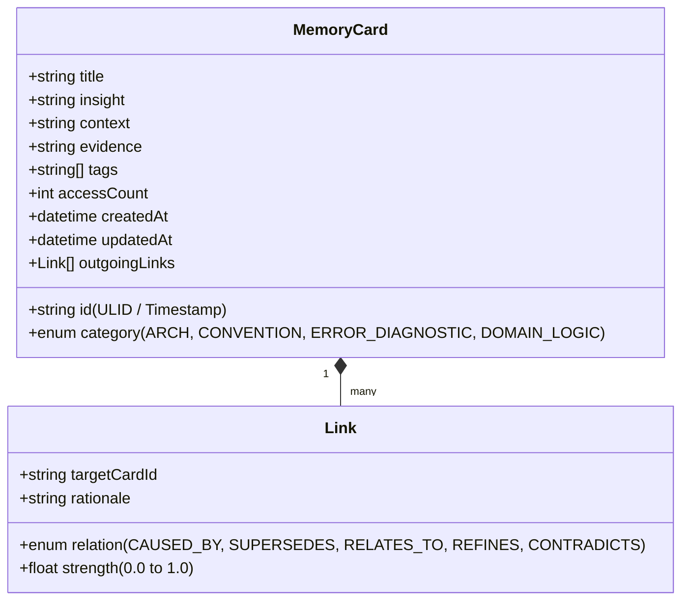
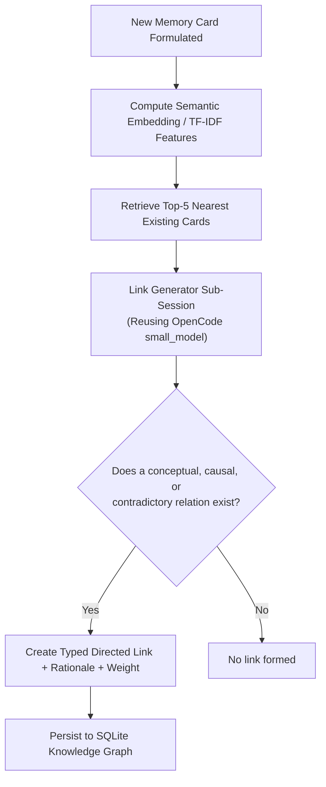

# LiveMemory Technical Specification
### Agentic Memory (A-Mem) & Zettelkasten Knowledge Systems in OpenCode

## 1. Overview & Objectives

Traditional agent memory approaches (simple RAG) dump unstructured conversation chunks into a vector database. This breaks down in real-world software engineering because the agent lacks control over how its experiences are indexed, related, and evolved.

**LiveMemory** implements the **A-Mem (Agentic Memory)** paradigm inspired by the **Zettelkasten** method:
1. **Autonomous Note Formulation**: The agent synthesizes atomic, schema-free memory cards containing concise insights, context, and evidence.
2. **Dynamic Link Generation**: The system evaluates new notes against past memories to generate conceptual, causal, and sequential connections dynamically.
3. **Dual-Layer Experience Bank**:
   - *Episodic Diagnostic Bank*: Captures error signatures, root causes, and successful recovery workflows.
   - *Conceptual Zettelkasten Graph*: Captures codebase conventions, architecture decisions, and domain invariants.
4. **Compaction Context Enrichment**: Seamless integration with OpenCode's `experimental.session.compacting` hook to ensure critical learnings persist across token compactions.

---

## 2. The Zettelkasten Memory Card Data Model

Each atomic memory card in `.opencode/dna/memory/graph.db` conforms to the following schema:



### Example Zettelkasten Note (JSON Representation):
```json
{
  "id": "01J7K3X98MZWR12Q8N2E4V6H7P",
  "title": "Bun Test Timeout with Native Addons",
  "category": "ERROR_DIAGNOSTIC",
  "insight": "Native node-pty and sqlite bindings require explicit process teardown in Bun test runners, otherwise tests hang indefinitely at exit.",
  "context": "Occurred during LiveTools verification test runs for terminal automation.",
  "evidence": "bun test exited after 30s timeout with unclosed handle in NodePtyAdapter.",
  "tags": ["bun", "node-pty", "testing", "hang"],
  "accessCount": 4,
  "createdAt": "2026-09-08T16:15:00Z",
  "updatedAt": "2026-09-08T16:15:00Z",
  "links": [
    {
      "targetCardId": "01J7K1A55MZWR12Q8N2E4V6H00",
      "relation": "CAUSED_BY",
      "strength": 0.92,
      "rationale": "Directly explains process hang observed in live tool test sandbox."
    },
    {
      "targetCardId": "01J7J9988MZWR12Q8N2E4V6H99",
      "relation": "REFINES",
      "strength": 0.78,
      "rationale": "Adds teardown requirement to generic Bun test runner conventions."
    }
  ]
}
```

---

## 3. Dynamic Link Generation Pipeline

Unlike static databases with rigid relational foreign keys, link generation occurs autonomously when a note is created:



The Link Generator prompt asks the model:
> "Given new card A and candidate card B, determine if there is an epistemic connection:
> - Does A explain the cause of B? (`CAUSED_BY`)
> - Does A refine or narrow B? (`REFINES`)
> - Does A supersede an older obsolete finding B? (`SUPERSEDES`)
> - Does A contradict B? (`CONTRADICTS`)
> Output the relation and confidence score."

---

## 4. The Diagnostic Failure Bank

The Diagnostic Bank records high-resolution telemetry from failures intercepted via:
- `EventSessionError`
- `tool.execute.after` (when `output` contains an error flag or non-zero exit code)
- `command.execute.before` / shell execution failures

### Structure of a Diagnostic Trace:
1. **Error Signature**: Normalized regex of the error output (e.g. `TS2345: Argument of type '.*' is not assignable to parameter of type '.*'`).
2. **Environmental State**: File modified, git branch, node/bun version.
3. **Recovery Sequence**: What tool or edit resolved the error.
4. **Distilled Heuristic**: Automatically condensed into an `ERROR_DIAGNOSTIC` Zettelkasten card.

---

## 5. Session Compaction Integration (`experimental.session.compacting`)

One of the most powerful hooks in OpenCode is `experimental.session.compacting`. When a long-running session reaches the model's context window limit, OpenCode compacts the session into a summary.

Project DNA intercepts this event to inject vital epistemic state that would otherwise be lost:

```typescript
"experimental.session.compacting": async (input, output) => {
  // Query memories and diagnostics created during this session
  const sessionMemories = await memoryStore.getNotesForSession(input.sessionID);
  const activeDiagnostics = await diagnosticBank.getActiveErrors(input.sessionID);

  output.context.push(`
## Project DNA: Epistemic Memory State (Persisted across compaction)
The following knowledge notes were established in this session:
${sessionMemories.map(m => `- [${m.category}] ${m.title}: ${m.insight}`).join("\n")}

Active Diagnostic Traps to Avoid:
${activeDiagnostics.map(d => `- Error: ${d.signature} -> Fix: ${d.recoveryRule}`).join("\n")}
`);
}
```

This guarantees that the agent retains architectural decisions and error-recovery lessons even after context window summarization!

---

## 6. Open Memory Standard & Portability

To prevent vendor lock-in, LiveMemory supports continuous export to the **Open Memory** format (`.opencode/dna/memory/exports/memory-export.json`). This JSON archive contains:
- Nodes (Zettelkasten cards)
- Edges (Typed links with weights)
- Chronological changelog

This export can be shared across team members, committed to git, or loaded into other coding environments.
