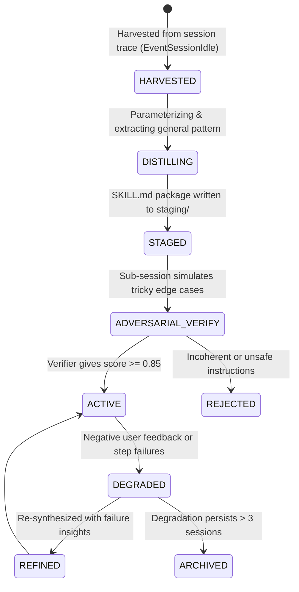
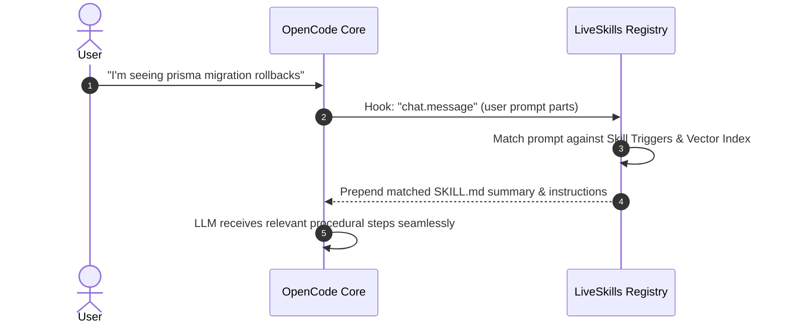

# LiveSkills Technical Specification
### Dynamic Procedural Knowledge Lifecycle in OpenCode

## 1. Overview & Objectives

While **LiveTools** provide deterministic executable functions, **LiveSkills** capture higher-level procedural workflows, strategies, and multi-step heuristics. 

Traditional agent skills are static markdown documents written by humans. In **Project DNA**, skills are living artifacts:
1. **Harvested** from successful multi-step execution traces within OpenCode sessions.
2. **Distilled** into standardized `SKILL.md` packages with parameterization and validation scripts.
3. **Adversarially Verified** against simulated failure modes.
4. **Lifecycle-Managed** with automated usage scoring, deduplication, and pruning.

---

## 2. Standardized `SKILL.md` Package Schema

Each skill is stored in `.opencode/dna/skills/active/<skill-id>/`:

```
.opencode/dna/skills/active/git-conflict-resolver/
├── SKILL.md                 # Primary instruction file with YAML frontmatter
├── scripts/                 # Optional helper scripts invoked by the skill
│   └── check-markers.sh
└── references/              # Contextual docs, examples, error patterns
    └── common-conflicts.md
```

### `SKILL.md` Structure:
```markdown
---
name: git-conflict-resolver
description: Systematically resolve complex 3-way Git rebase and merge conflicts without losing work
version: 1.2.0
tags: [git, vcs, merge, rebase]
triggers:
  - "resolve merge conflict"
  - "git rebase CONFLICT"
  - "unmerged paths"
author: dna-synthesizer
confidence_score: 0.94
executions: 18
last_verified: 2026-09-08T16:00:00Z
---

# Git Conflict Resolver

## Overview
Detailed situational diagnosis and strategy for 3-way git rebase conflicts.

## Step-by-Step Procedure
1. Run `git status` to enumerate all conflicted files.
2. For each conflicted file, inspect conflict markers:
   - `<<<<<<< HEAD`: Current work
   - `=======`: Divider
   - `>>>>>>> <branch>`: Incoming changes
3. If helper script is available, execute:
   `bash .opencode/dna/skills/active/git-conflict-resolver/scripts/check-markers.sh`
4. Re-run project test suite before running `git add` and `git rebase --continue`.

## Critical Pitfalls
- Never use `git checkout --ours/--theirs` without checking which side represents HEAD during a rebase.
- Verify lockfiles (`bun.lock`, `package-lock.json`) are regenerated rather than manually merged.
```

---

## 3. The Skill Lifecycle Engine



---

## 4. Evidence Harvester Pipeline

The evidence harvester observes live sessions through OpenCode hooks:

1. **Telemetry Ingestion**:
   - `tool.execute.before` & `tool.execute.after`: Tracks inputs, outputs, commands run, and exit codes.
   - `chat.message`: Identifies user intent and subsequent verification of task completion.
2. **Success Signature Detection**:
   - A sequence is eligible for harvesting when:
     - The user's request required $\ge 3$ consecutive tool/command steps.
     - At least one recovery from an intermediate error occurred.
     - Final state produced a green test run or explicit user confirmation ("thank you", "looks good", "fixed").
3. **Trace Buffering**:
   - The sequence of `{ tool, args, output, thought }` is stored in session memory until `EventSessionIdle`.

---

## 5. Skill Distillation & Parameterization

When `EventSessionIdle` fires, a background sub-session runs the **Skill Distiller**:

```
[Input Trace]
Turn 1: npm test -> Error: PrismaClientKnownRequestError: Migration failed
Turn 2: npx prisma migrate resolve --rolled-back "20260908_init"
Turn 3: npx prisma migrate dev
Turn 4: npm test -> All 24 tests passed

[Distillation Prompt Target]
1. Strip hardcoded repository names, file paths, and dates.
2. Extract generalized trigger phrases.
3. Formulate the root diagnostic principle.
4. Structure the step-by-step guidance into standard SKILL.md.
```

---

## 6. Dynamic Injection into OpenCode Context

Project DNA selectively injects skills to avoid saturating context windows:



Using the `"chat.message"` or `"experimental.chat.system.transform"` hook:
- Top-K matched skills (typically $K \le 2$) are injected with a concise guideline.
- If the agent needs scripts or full references, it reads them directly from `.opencode/dna/skills/active/<id>/`.

---

## 7. Pruning, Merging & Deduplication

As the skill library expands:
1. **Deduplication Check**: When a new skill is proposed, semantic similarity against existing active skills is computed. If cosine similarity $> 0.85$, the synthesizer **merges** the new observations into the existing `SKILL.md` (incrementing the version number) instead of creating a duplicate.
2. **Degradation Scoring**:
   - If an injected skill is followed by consecutive command failures or user corrections, its `confidence_score` drops.
   - If `confidence_score` falls below $0.5$, it moves from `active/` to `archive/`.
