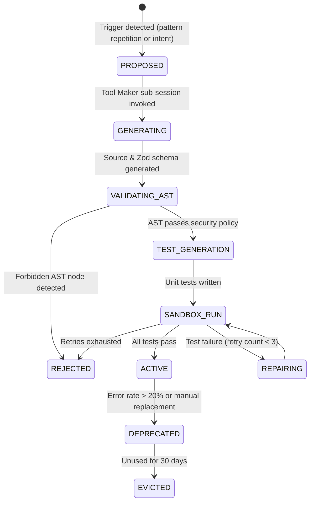

# LiveTools Technical Specification
### The LATM (Large Language Models as Tool Makers) Paradigm in OpenCode

## 1. Overview & Objectives

**LiveTools** enables OpenCode to convert transient, compute-heavy problem-solving routines into permanent, reusable TypeScript tools. 

Instead of an agent repeatedly re-generating bash scripts or parsing complex files across multiple turns, the **Tool Maker** pipeline:
1. Synthesizes a dedicated TypeScript tool module using `@opencode-ai/plugin/tool`.
2. Automatically authors an adversarial unit test suite with mock inputs and assertions.
3. Executes the test suite in a sandboxed runner.
4. Hot-loads the tool into OpenCode's live tool registry without requiring a server restart.

---

## 2. The Tool Maker vs. Tool User Split

```mermaid
flowchart TD
    subgraph ToolUserLoop["User Turn Loop (Fast / Cheap)"]
        UserMsg["User Prompt"] --> Agent["OpenCode Agent"]
        Agent --> NeedTool{"Tool exists in<br/>LiveTools Registry?"}
        NeedTool -->|Yes| ExecTool["Execute Cached Tool (Zero synthesis cost)"]
        NeedTool -->|No| FallbackBash["Solve via multi-turn shell/scripts"]
    end

    subgraph ToolMakerLoop["Background Synthesis Loop (Autonomous / Robust)"]
        FallbackBash --> RecurPattern{"Pattern repeated<br/>>= 2 times OR<br/>explicitly requested?"}
        RecurPattern -->|Yes| Synthesize["Tool Maker: Synthesize Tool & Zod Schema"]
        Synthesize --> GenTests["Tool Maker: Synthesize Unit Test Suite"]
        GenTests --> Sandbox["Isolated Runner: Execute bun test"]
        Sandbox -->|Pass| HotReload["Hot-Reload into Tool Registry"]
        Sandbox -->|Fail (retry <= 2)| SelfRepair["Self-Repair Prompt"]
        SelfRepair --> Sandbox
        Sandbox -->|Exhausted| Reject["Log Failure to Diagnostic Bank"]
    end
```

---

## 3. Tool Code Structure & Specification

All synthesized tools must implement the native OpenCode tool signature:

```typescript
import { tool } from "@opencode-ai/plugin/tool"
import { z } from "zod"

export const MySynthesizedTool = tool({
  description: "Precise semantic description used by the LLM for tool selection",
  args: {
    paramA: z.string().describe("Explanation of paramA"),
    paramB: z.number().optional().describe("Explanation of paramB"),
  },
  async execute(args, ctx) {
    // ctx provides:
    // - ctx.directory: current workspace directory
    // - ctx.worktree: git worktree root
    // - ctx.abort: AbortSignal
    // - ctx.ask(): permission escalation modal
    // - ctx.metadata(): UI display metadata
    
    return {
      title: "Completed operation",
      output: "Structured result output",
    }
  }
})
```

---

## 4. Synthesis & Verification Lifecycle



### Phase 1: Synthesis & AST Static Analysis
The Tool Maker background session generates:
1. `tool.ts`: Implementation with typed Zod args and deterministic error handling.
2. `tool.test.ts`: Test suite testing:
   - Happy path with representative data.
   - Edge cases (empty strings, missing files, invalid inputs).
   - Expected error scenarios.

Before any code is executed, the AST checker verifies:
- No dynamic `eval()` or `Function()` constructor.
- No `child_process.execSync` without sanitized parameters.
- No process lifecycle hijacking (`process.exit`, `process.kill`).

### Phase 2: Sandboxed Test Execution
The test runner invokes Bun's test runner in an isolated directory:
```bash
bun test .opencode/dna/tools/tests/<tool_name>.test.ts --timeout 5000
```
- If the test suite exits with code 0 in < 5000ms, the tool is marked `VERIFIED`.
- If an assertion fails, the stack trace is fed back into a `ToolRepairer` sub-session.

---

## 5. Hot-Reload Tool Registry Architecture

OpenCode expects a dictionary of `ToolDefinition` in the `tool` hook of `@opencode-ai/plugin`:

```typescript
export const ProjectDNAPlugin: Plugin = async (ctx) => {
  const toolRegistry = new LiveToolRegistry(ctx.directory);
  await toolRegistry.loadActiveTools();

  return {
    // Dynamic tool map exposed to OpenCode
    tool: toolRegistry.getToolMap(),

    // Dynamic schema & description mutation
    "tool.definition": async (input, output) => {
      const customDef = toolRegistry.getOverride(input.toolID);
      if (customDef) {
        output.description = customDef.description;
        output.parameters = customDef.parameters;
      }
    },

    // Execution telemetry & degradation tracking
    "tool.execute.after": async (input, output) => {
      if (toolRegistry.isLiveTool(input.tool)) {
        toolRegistry.recordExecution(input.tool, output);
      }
    }
  }
}
```

When a new tool passes the sandbox verification while an OpenCode session is running:
1. The tool module is compiled/transpiled in `.opencode/dna/tools/src/<name>.ts`.
2. `toolRegistry.register(name, module)` dynamically adds the function into the internal registry.
3. If OpenCode caches tools per turn, the new tool becomes immediately selectable in the very next turn.

---

## 6. Degradation Scoring & Eviction

Every tool tracked in `.opencode/dna/tools/registry.json` maintains runtime health metrics:

$$\text{Health Score} = \frac{\text{Successes}}{\text{Total Calls}} \times \left(1 - \frac{\text{Failures in Last 5 Calls}}{5}\right)$$

- **Health Score < 0.6**: The tool is flagged `DEGRADED`. The agent is prompted to repair or mutate the implementation.
- **Unused for 100 turns + Degraded**: Automatically transitioned to `ARCHIVED` to preserve context window token efficiency.
