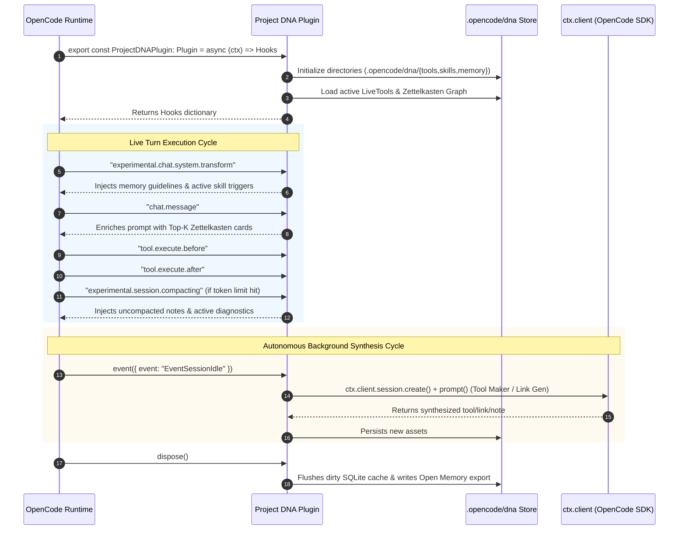

# OpenCode Plugin Integration Specification
### Native Hook Lifecycle, Event Dispatch & LLM Reuse Protocol

## 1. Overview

This document specifies the integration contracts between **Project DNA** and the **OpenCode** plugin architecture (`@opencode-ai/plugin` v1.18+).

Project DNA acts as a transparent, high-performance middleware layer within OpenCode, providing procedural tool synthesis, dynamic skills, and Zettelkasten memory management while leveraging OpenCode's native runtime primitives.

---

## 2. Plugin Lifecycle & Hook Matrix



---

## 3. The Zero-Friction LLM Reuse Protocol

Project DNA operates without requiring external API keys. It utilizes OpenCode's internal SDK client (`ctx.client`) provided in `PluginInput`:

```typescript
export type PluginInput = {
  client: ReturnType<typeof createOpencodeClient>
  project: Project
  directory: string
  worktree: string
  experimental_workspace: {
    register(type: string, adapter: WorkspaceAdapter): void
  }
  serverUrl: URL
  $: BunShell
}
```

### Synthesis Execution Helper
```typescript
export class OpenCodeLLMBridge {
  constructor(private client: ReturnType<typeof createOpencodeClient>) {}

  /**
   * Dispatches a background synthesis task using OpenCode's configured LLM
   */
  async synthesize(options: {
    system: string
    prompt: string
    useSmallModel?: boolean
  }): Promise<string> {
    // 1. Fetch current OpenCode model configuration
    const config = await this.client.config.get();
    
    // 2. Select appropriate model (small model for classification, primary for generation)
    const targetModel = (options.useSmallModel && config.data?.small_model) 
      ? config.data.small_model 
      : config.data?.model;

    // 3. Create isolated headless session
    const session = await this.client.session.create({
      body: {
        title: "dna:background-worker",
      },
    });

    try {
      // 4. Prompt the model
      const result = await this.client.session.prompt({
        path: { id: session.data.id },
        body: {
          model: targetModel,
          system: options.system,
          parts: [{ type: "text", text: options.prompt }],
        },
      });

      // 5. Extract text response
      const message = result.data?.parts?.find(p => p.type === "text");
      return message?.text ?? "";
    } finally {
      // 6. Delete background session to avoid UI clutter
      await this.client.session.delete({ path: { id: session.data.id } });
    }
  }
}
```

---

## 4. OpenCode Event Handling Matrix

The plugin registers a top-level `event` handler:

```typescript
event: async ({ event }) => {
  switch (event.type) {
    case "EventSessionCreated":
      await memoryStore.initSessionSpace(event.sessionID);
      break;

    case "EventSessionIdle":
      // Fires when agent finishes turn. Prime moment for non-blocking synthesis!
      await synthesisQueue.processPending({
        sessionID: event.sessionID,
        onSynthesizeTool: (spec) => toolMaker.synthesize(spec),
        onDistillSkill: (trace) => skillDistiller.distill(trace),
        onGenerateLinks: (note) => linkGenerator.generateLinks(note),
      });
      break;

    case "EventSessionCompacted":
      await memoryStore.synchronizeCompactedSession(event.sessionID);
      break;

    case "EventSessionError":
      await diagnosticBank.recordSessionError({
        sessionID: event.sessionID,
        error: event.error,
      });
      break;

    case "EventCommandExecuted":
      if (event.exitCode !== 0) {
        await diagnosticBank.recordCommandFailure({
          command: event.command,
          exitCode: event.exitCode,
          output: event.output,
        });
      }
      break;
  }
}
```

---

## 5. Hook Implementation Matrix

| Hook Name | Role in Project DNA | Input / Output Transform |
| :--- | :--- | :--- |
| `tool` | Exposes active synthesized tools | Returns `{ [toolName: string]: ToolDefinition }` compiled in `.opencode/dna/tools/src/`. |
| `"tool.definition"` | Dynamic parameter schema & description optimization | Modifies `output.description` or `output.parameters` based on task context. |
| `"tool.execute.before"` | Pre-execution safety checking & trace logging | Buffers input args and execution start time. |
| `"tool.execute.after"` | Execution telemetry & error interception | Records metrics; logs diagnostics if errors occurred. |
| `"chat.message"` | Zettelkasten note & skill injection | Appends matching memory cards and skills to `output.parts`. |
| `"experimental.chat.system.transform"` | Dynamic system prompt enrichment | Appends high-level DNA guidelines into `output.system[]`. |
| `"experimental.session.compacting"` | Long-term memory preservation | Appends uncompacted session memory notes to `output.context[]`. |
| `dispose` | Graceful shutdown & cache persistence | Flushes SQLite WAL, saves registry state, cleans up test temp files. |

---

## 6. Permissions & Safety Integration

When a synthesized LiveTool performs write or shell operations:
- The tool calls `ctx.ask()`:
  ```typescript
  await ctx.ask({
    permission: "tool:write",
    patterns: [targetPath],
    always: ["trust-project-dna-tools"],
    metadata: { reason: "LiveTool requires writing cache file" },
  });
  ```
- OpenCode's standard permission dialogue is invoked, preserving user consent and security boundaries.
